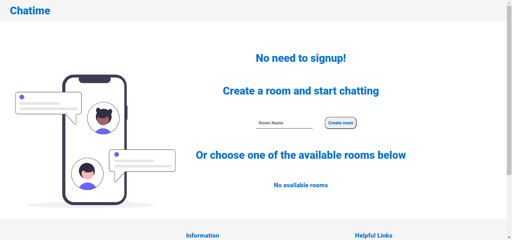

# Linkus

Linkus is a chat rooms application where you can join a room and start group chatting or just create your own room.

## Demo 

Click [here](https://linkus-chat-app.herokuapp.com/) for live demo.


## Installation

Clone the source locally:
```
$ git clone https://github.com/SaifAlsabe/chat-app
$ cd chat-app
```

Install project dependencies:
```
$ npm install
```

Start the app:
```
$ npm start
```

## Built With

HTML, CSS, vanilla JavaScript, Node.js, Socket.IO


